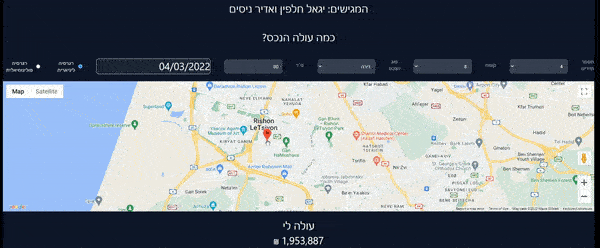

# Realestate Project

## Introduction
Data science project including
* Crawling method with selenium
* Data cleaning 
* EDA and visualization
* ML

## Authors
* Adir Nisim
* Igal Khalfin

#Fast api instructions
* Go to Server folder and open cmd from the url 
* Type command below and leave it open:
1.uvicorn Main:app --reload

# React webclient 
Go to house-prediction-client folder and open cmd from the url 
* Type command below and leave it open:
1. nmp start

